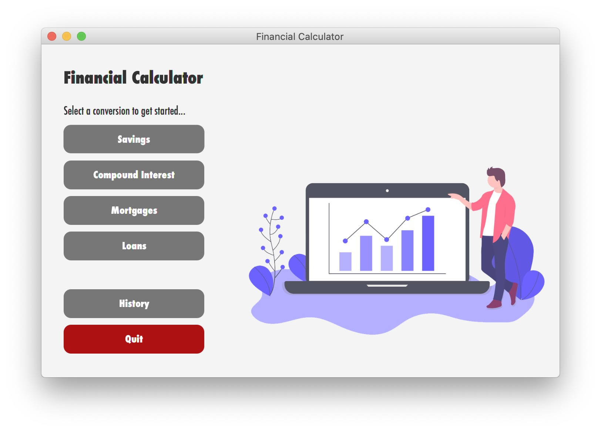
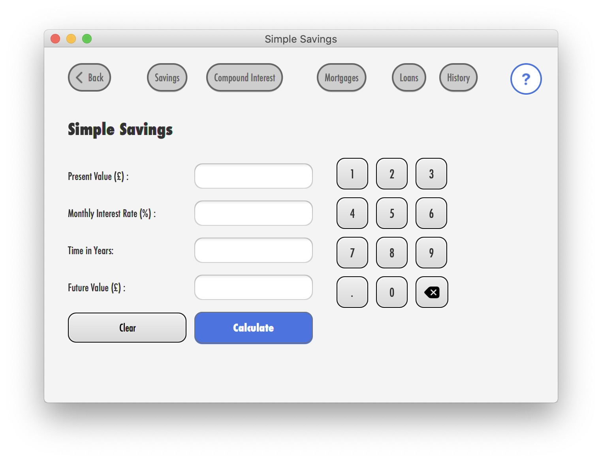

# Financial Calculator

This repo contains files for the project that was completed under the Programming Principles 2 Module in the 1st year at IIT. The project consisting of a GUI (JavaFX) application.

The program has the following functionality:
 1.  Views for the below financial calculators:
		-  Compound Interest Savings
		- Simple Savings
		- Loans
		- Mortgage
2. The app will calculate the missing field in all views when 'Calculate' button is pressed after the data is entered.
3. Contains a help view Microsoft Word that will contain instructions and guidance to the user on how to use the software.

## Screenshots

## Used Versions  
* [JDK 8: v1.8.0.251 ](https://www.oracle.com/java/technologies/javase/javase-jdk8-downloads.html)
